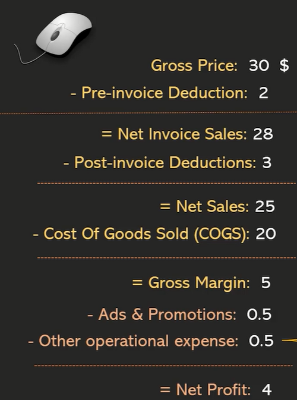
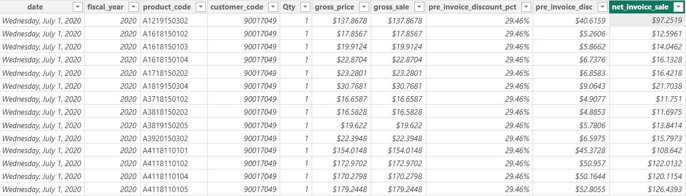
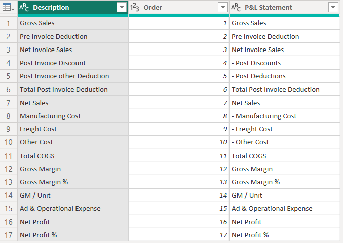
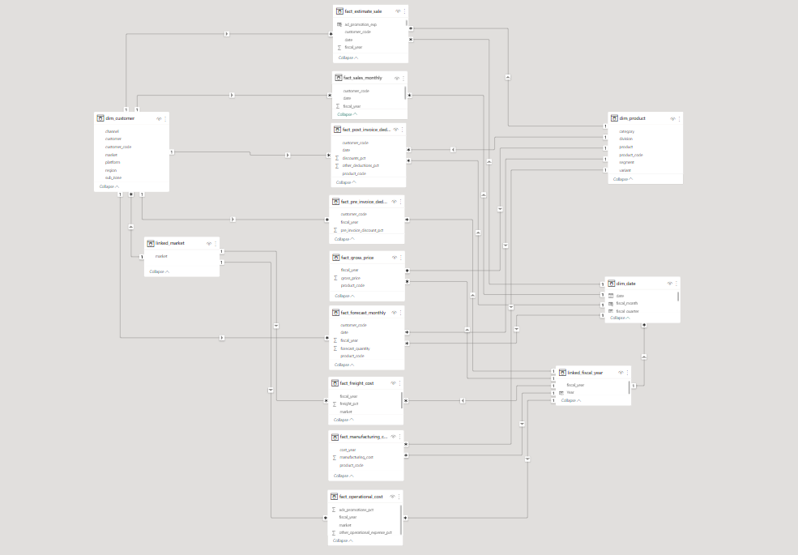
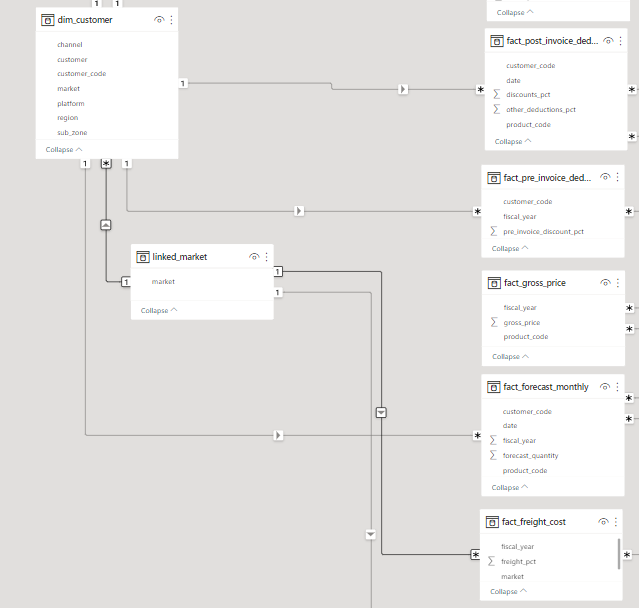
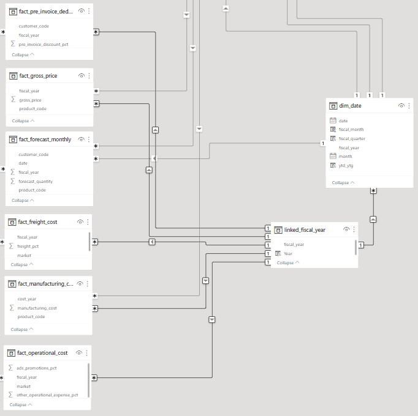

# AtliQ P&L Statement - Power BI Report
For desktop file: https://drive.google.com/file/d/1bv0fC4aR0X6sGNlZqOEi179pn0lFi_AU/view?usp=share_link


---


The report includes 6 elements:
- Key metrics include Net Sale ($), Gross Margin (%), Net Frofit (%)
- P&L Statement
- A Line chart compares P&L values between selected year and its previous year
- A bar chart compares P&L values across different customers
- A heatmap conveys how much particular products account for a specific P&L values
- Filters by fiscal years, months, and YTD, YTG

# I. Problem Context
AtliQ was established in 2017 as an IT services company to help businesses integrate their processes with automated tools. Over the past 5 years, AtliQ has successfully provided many businesses with custom solutions that help them scale, or streamline their processes, reduce overhead costs and increase overall efficiency.

The CEO of the company wants to have an dynamic report to show Profit and Loss statement to understand financial performance across markets, products, and customers.

Users are able to use the tool in their busines review meetings and in their decision making process such as customer negotiation, new product launch, marketing promotions, fnance budgeting etc.

Project Goals:
Build an interactive dashboard and pulish it onlune to unlock insights about the financial performance and enable data-driven decision making across company departments.

# II. Power Query practices
## 1. Create "fact_estimate_sale" table
In order to create P&L statement, I need to calculate the following features:




Given the sale data only updated to 1st December 2021, It's required to join forcast data (Year-to-Go data) in  `fact_forecast_monthly` table and actual data (Year-to-Date data) in "fact_sales_monthly" to a new one called "fact_estimate_sale" table so that I'm able to conduct P&L statement and financial analysis from 2018 to the end of 2022.

Furthermore, multiple tables would need combining together so features for calculating P&L statement were available.

The following steps were performed to create `fact_estimate_sale` table:
- Calculate the last acutal sale date from *fact_sale_monthly"
```dax
last_sale_date = List.Max(fact_sales_monthly[date])
```

- Create "remain_gross_sale" as referencing table of "fact_forcast_monthly"
- In "remain_gross_sale" filtered out Year-to-Go rows which have *date* greater than *last_sale_date*
```dax
remain_gross_sale = Table.SelectRows(Source, each ([date] > last_sale_date)))
```

- Concat "fact_estimate_sale" and "remain_gross_sale" by rows would result in `fact_estimate_sale` table

```dax
fact_estimate_sale = Table.Combine({fact_sales_monthly, remain_gross_sale})
```

- Perform Merging "fact_estimate_sale" table to other fact tables include "fact_gross_sale", "pre_invoice_deductions" to extract *gross_price* and *pre_invoice_discount_pct* columns based on primary keys *fiscal_year*, *product_code*, and *customer_code*.
- *net_invoice_sale* column was then calculated for future analysis.

The created `fact_estimate_sale`




## 2. Create "P&L_structure" table for structuring P&L statement visual




# III. Data Model




---
The data model is formed in Star Schema with fact tables (include transactions) being put in center and dimension tables (include descriptive information) placed around.

## 1. Fact tables in data model
- fact_estimate_sale
- fact_sale_monthly
- fact_pre_invoice_deductions
- fact_post_invoice_deductions
- fact_gross_price
- fact_forecast_monthly
- fact_freight_cost
- fact_manufactoring_cost
- fact_operational_cost

## 2. Dimension tables in data model
- dim_customer
- dim_product
- dim_date

## 3. Resolve many-to-many relationship


- `linked_market` was created as a bridge table for resolving many-to-many relationship between "dim_customer" and "fact_freight_cost" table as both tables contained primary key column *market* with multiple values.




- Similarly, `linked_fiscal_year` was created as bridge table for resolving many-to-many relationship between dimension table "dim_date" and "fact_pre_invoice_deductions", "fact_gross_price", "fact_forecast_monthly", "fact_freight_cost", "fact_manufactoring_cost", "fact_operational_cost" tables as foreign key column *fiscal_year* of those fact tables and primary key of the dimension table had multiple values.




# IV. DAX practices
## 1. Calculated Columns

Based on the initial `fact_estimate_sale` table, I perform calculated other elements of P&L statement including:

- *post_invoice_discount*
```dax
post_invoice_discount = 
var disc_pct = CALCULATE(max('fact_post_invoice_deductions'[discounts_pct]), RELATEDTABLE('fact_post_invoice_deductions'))
return disc_pct*fact_estimate_sale[net_invoice_sale]
```
- *post_invoice_other_deduction*
```dax
post_invoice_other_deduction = 
var disc_pct = CALCULATE(max('fact_post_invoice_deductions'[other_deductions_pct]), RELATEDTABLE('fact_post_invoice_deductions'))
return disc_pct*fact_estimate_sale[net_invoice_sale]
```
- *net_sale*
```dax
net_sale = fact_estimate_sale[net_invoice_sale] - fact_estimate_sale[post_invoice_other_deduction] - fact_estimate_sale[post_invoice_discount]
```
- *manufactoring_cost*
```dax
manufacturing_cost = 
var cst = CALCULATE(max('fact_manufacturing_cost'[manufacturing_cost]), RELATEDTABLE('fact_manufacturing_cost'))
return cst*fact_estimate_sale[Qty]
```
- *freight_cost*
```dax
freight_cost = 
var disc_pct = CALCULATE(max('fact_freight_cost'[freight_pct]), RELATEDTABLE('fact_freight_cost'))
return disc_pct*fact_estimate_sale[net_sale]
```
- *other_cost*
```dax
other_cost = 
var pct = MAXX(CALCULATETABLE(fact_freight_cost), fact_freight_cost[other_cost_pct])
return pct*fact_estimate_sale[net_sale]
```
- *gross_margin*
```dax
gross_margin = fact_estimate_sale[net_sale] - fact_estimate_sale[manufacturing_cost] - fact_estimate_sale[freight_cost] - fact_estimate_sale[other_cost]
```
- *ad_promotion_exp*
```dax
ad_promotion_exp = 
var pct = CALCULATE(MAX(fact_operational_cost[ads_promotions_pct]), CALCULATETABLE(fact_operational_cost))
return
    pct * fact_estimate_sale[net_sale]
```
- *other_operational_exp*
```dax
other_operational_exp = 
var pct = MAXX(fact_operational_cost, fact_operational_cost[other_operational_expense_pct])
return
    pct * fact_estimate_sale[net_sale]
```
- *net_profit*
```dax
net_profit = fact_estimate_sale[gross_margin] - fact_estimate_sale[ad_promotion_exp] - fact_estimate_sale[other_operational_exp]
```
## 2. Calculated Measures
