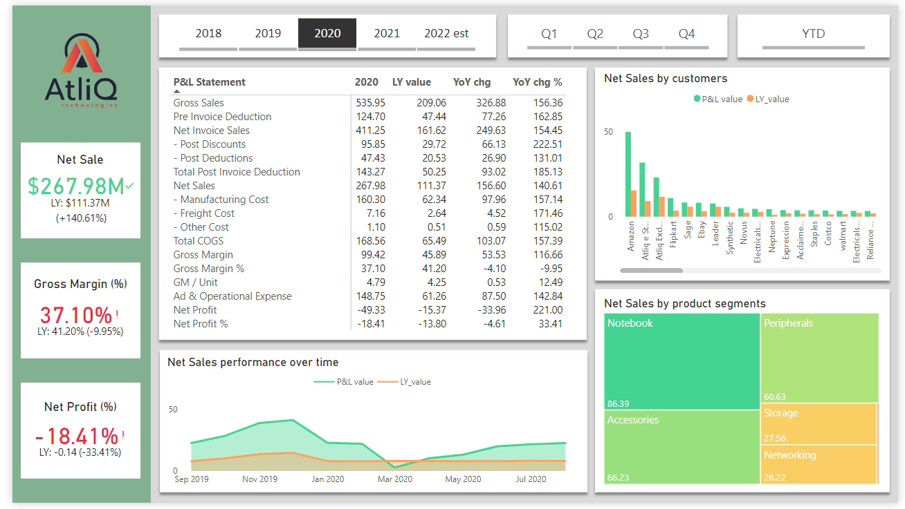

# AtliQ Finance Power BI Report
For desktop file: https://drive.google.com/file/d/1bv0fC4aR0X6sGNlZqOEi179pn0lFi_AU/view?usp=share_link


---


The report includes 6 elements:
- Key metrics include Net Sale ($), Gross Margin (%), Net Frofit (%)
- P&L Statement
- A Line chart compares P&L values between selected year and its previous year
- A bar chart compares P&L values across different customers
- A heatmap conveys how much particular products account for a specific P&L values
- Filters by fiscal years, months, and YTD, YTG

# I. Problem Context
AtliQ was established in 2017 as an IT services company to help businesses integrate their processes with automated tools. Over the past 5 years, AtliQ has successfully provided many businesses with custom solutions that help them scale, or streamline their processes, reduce overhead costs and increase overall efficiency.

The CEO of the company wants to have an dynamic report to show Profit and Loss statement to understand financial performance across markets, products, and customers.

Users are able to use the tool in their busines review meetings and in their decision making process such as customer negotiation, new product launch, marketing promotions, fnance budgeting etc.

Project Goals:
Build an interactive dashboard and pulish it onlune to unlock insights about the financial performance and enable data-driven decision making across company departments.

# II. Power Query practices
## 1. Create "fact_estimate_sale" table
In order to create P&L statement, I need to calculate the following features:


Given the sale data only updated to 1st December 2021, It's required to join forcast data (Year-to-Go data) in  `fact_forecast_monthly` table and actual data (Year-to-Date data) in "fact_sales_monthly" to a new one called "fact_estimate_sale" table so that I'm able to conduct P&L statement and financial analysis from 2018 to the end of 2022.

The following steps were performed to create `fact_estimate_sale` table:
- Calculate the last acutal sale date from *fact_sale_monthly"
```dax
last_sale_date = List.Max(fact_sales_monthly[date])
```

- Duplicate "fact_forcast_monthly" and rename it to "remain_gross_sale"
- In "remain_gross_sale" filtered out Year-to-Go rows which have *date* greater than *last_sale_date*
```dax
remain_gross_sale = = Table.SelectRows(Source, each ([date] > last_sale_date)))
```

- Duplicate "fact_sales_monthly" and rename to "fact_estimate_sale"
- Concat "fact_estimate_sale" and "remain_gross_sale" by rows

```dax
fact_estimate_sale = Table.Combine({fact_sales_monthly, remain_gross_sale})
```

- Perform Merging "fact_estimate_sale" table to other fact tables include "fact_gross_sale", "pre_invoice_deductions" to extract *gross_price* and *pre_invoice_discount_pct* columns based on primary keys *fiscal_year*, *product_code*, and *customer_code*.

# III. Data Model

# IV. DAX practices

# V. Summary
